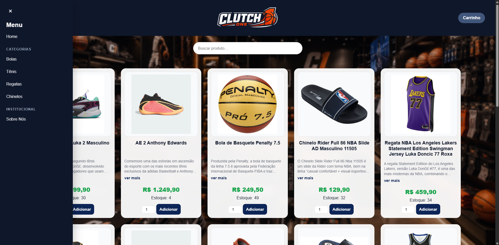
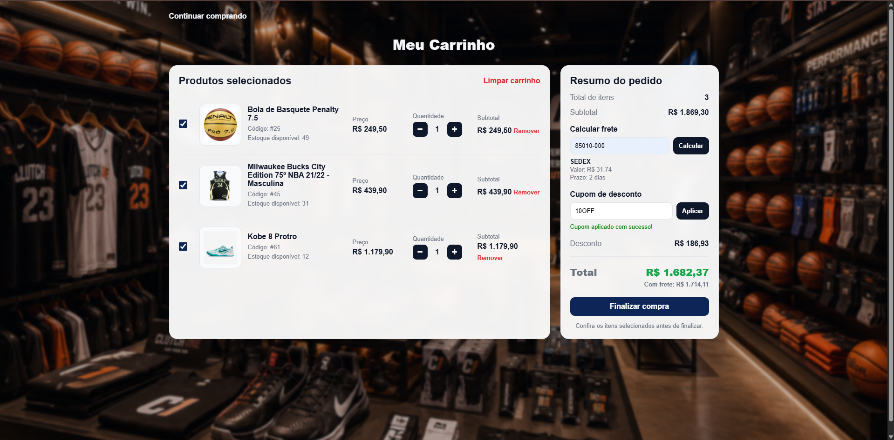
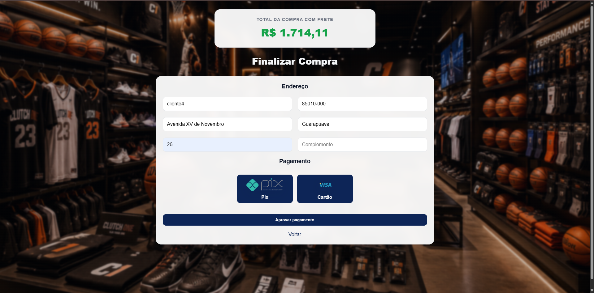
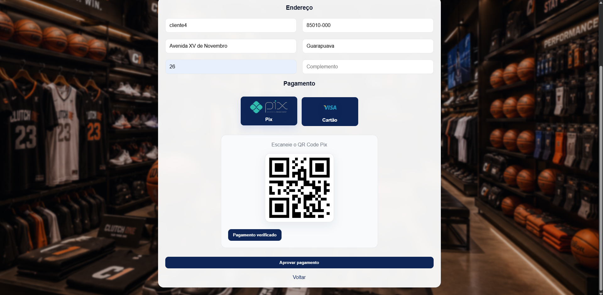
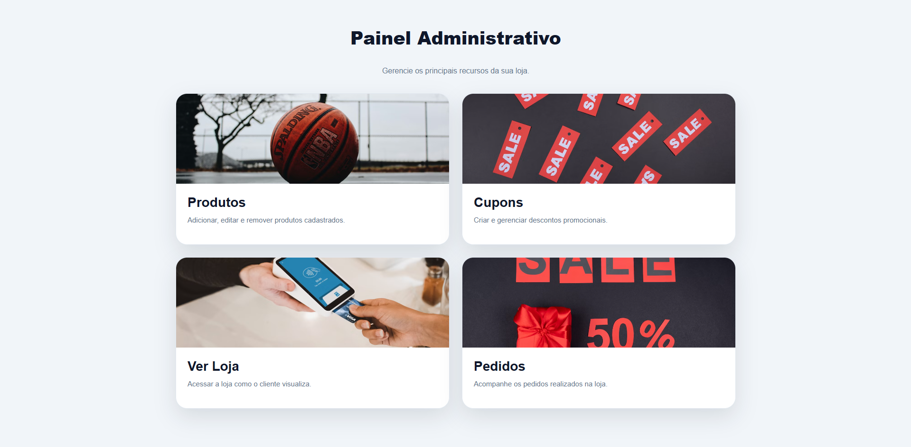
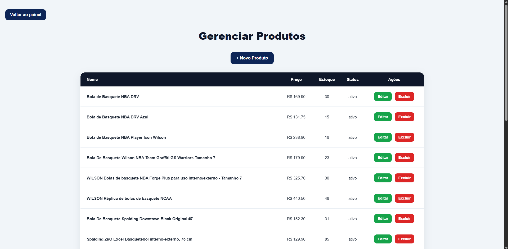
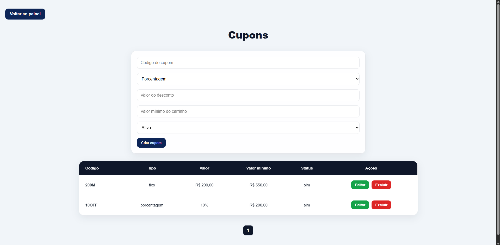
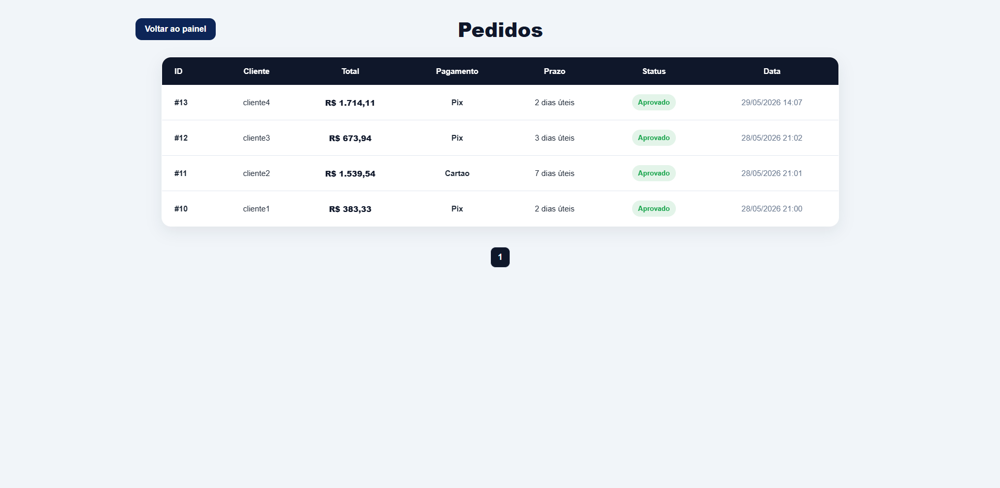

# Clutch One

Projeto de e-commerce desenvolvido com PHP, MySQL, HTML, CSS e JavaScript.


## Funcionalidades

- catálogo de produtos;
- carrinho de compras;
- cálculo de frete;
- cupons de desconto;
- simulação de pagamento;
- painel administrativo;
- controle de pedidos e estoque.

## Tecnologias

PHP, MySQL, HTML, CSS e JavaScript.

## Página Inicial


---

## Menu Lateral e Navegação



---

## Página Institucional


---

## Carrinho de Compras



---

## Checkout



---

## Pagamento via Pix



---

## Processamento de Pagamento


---

## Pagamento Aprovado


---

## Painel Administrativo



---

## Gerenciamento de Produtos



---

## Gerenciamento de Cupons



---

## Gerenciamento de Pedidos



---

# Como executar o projeto

## Opção 1 — Docker (recomendado)

### Requisitos

* Docker Desktop;
* Git.

### Passos

Clone o repositório:

```bash
git clone URL_DO_REPOSITORIO
```

Entre na pasta do projeto:

```bash
cd Projetofinal
```

Inicie os containers:

```bash
docker compose up -d
```

Acesse:

```text
http://localhost:8080
```

O banco de dados será criado automaticamente a partir do arquivo `produtos.sql`.

---

## Opção 2 — Linux

### Requisitos

* PHP 8 ou superior;
* MySQL ou MariaDB;
* Git.

### Instalação dos pacotes (Ubuntu/Debian)

```bash
sudo apt update
sudo apt install php php-mysql mysql-server git
```

Clone o repositório:

```bash
git clone URL_DO_REPOSITORIO
```

Entre na pasta:

```bash
cd Projetofinal
```

Crie o banco de dados:

```sql
CREATE DATABASE produtos;
```

Importe o arquivo:

```bash
mysql -u root -p produtos < produtos.sql
```

Verifique as configurações do arquivo `conexao.php`:

```php
$host = "localhost";
$user = "root";
$pass = "";
$db = "produtos";
```

Inicie o servidor PHP:

```bash
php -S localhost:8000
```

Acesse:

```text
http://localhost:8000
```
